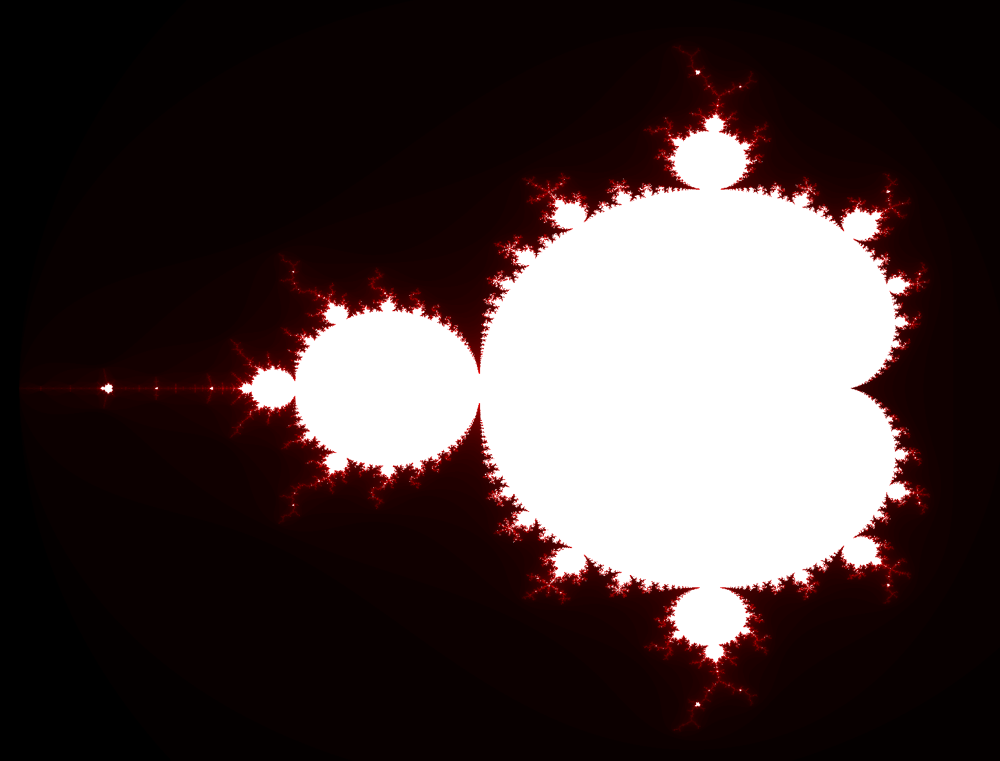
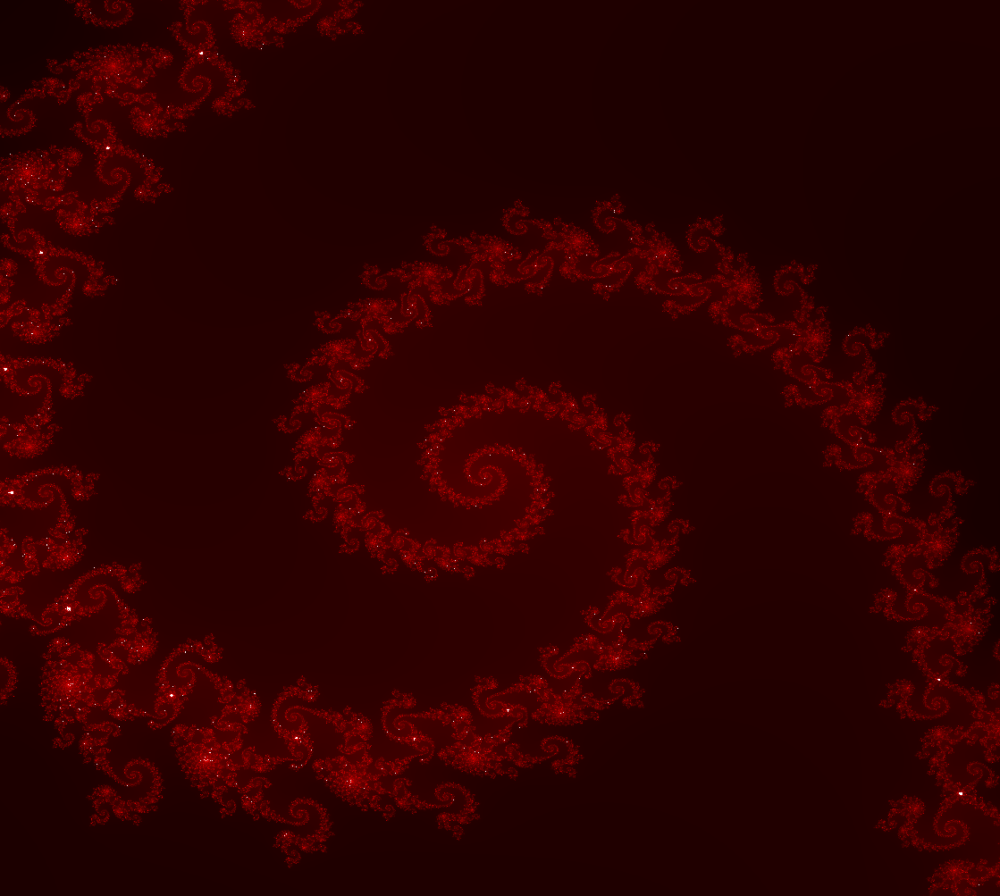
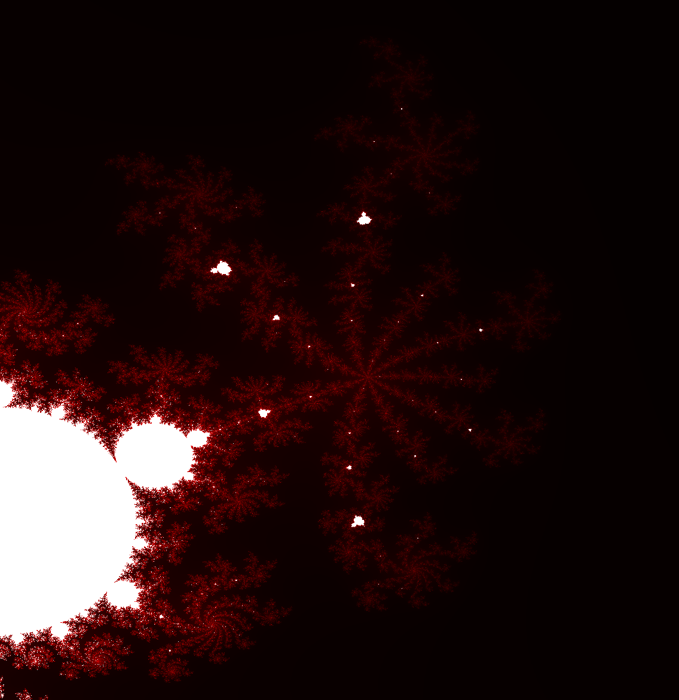

# Rust Mandelbrot Set Visualizer

OpenGL-based GPU renderer of the Mandelbrot set, the set of all complex numbers `c` for which the series `f(n) = f(n-1)^2 + c` with `f(0) = 0` does not diverge to infinity. Numbers close to the edge are colored in a shade of red depending on how quickly their series grows.

## Controls

Drag with the left mouse button to move around, scroll to zoom. Use the up and down keys to increase/decrease the number of iterations performed, trading performance for accuracy.

## Platform Support

Currently only Linux using the Wayland windowing system is supported, more to come in the future.

## Dependencies

None, except the dynamic libraries required for the graphics driver and window setup. Everything else is hand-made.

## Gallery

### Spiral in the Seahorse Valley

### Fractal web next to a copy of the set

